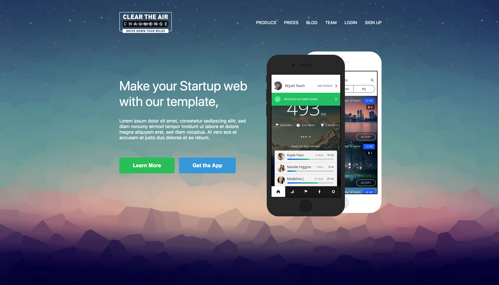

# Website-11-29-2022
## Aufgabe
- Positionierung von Elementen - Nachbau einer Webseite Vorlage siehe unten.
## Nachbildung einer Webseite durch einen Screenshot:

###### Dieses Projekt ist eine Übungsaufgabe und ist nicht für alle devices gestyled.
    - Teilweise responsive
## Die Online-Version

Um die Live-Version zu sehen, einfach [klicken...!](https://github.com/jensensitve/11-28-2022-website-flex-responsive/deployments/activity_log?environment=github-pages)

# Hamburger Menu noch nicht komplett fertig.
    -Hamburger Menu symbol wird beim drücken nicht angezeigt.

